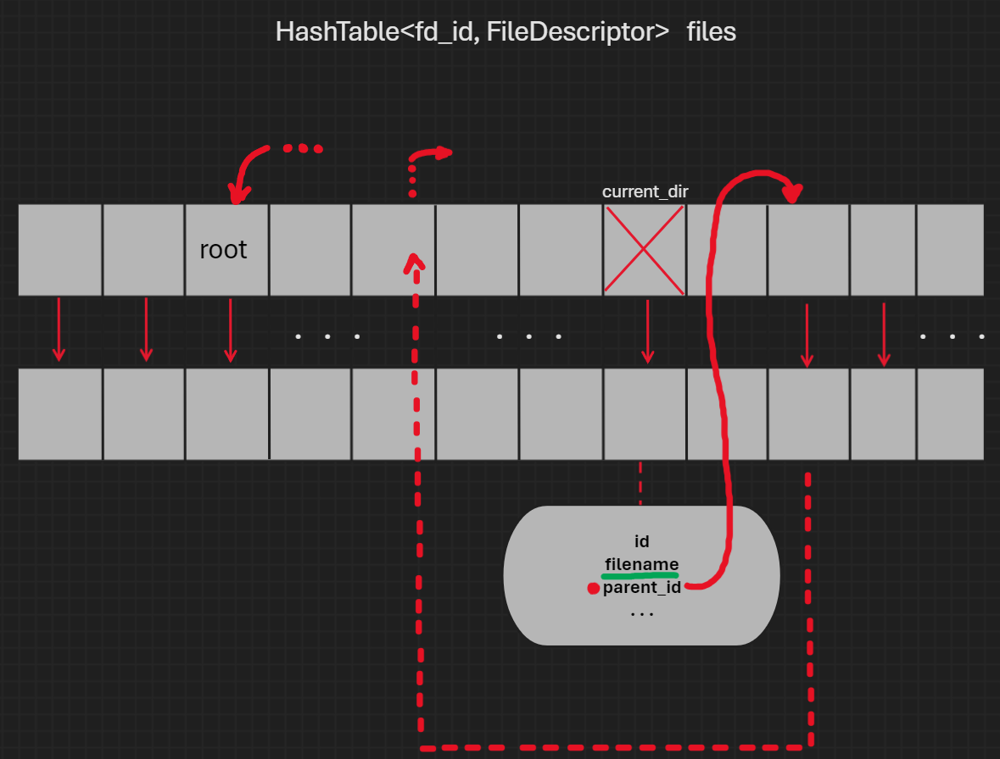
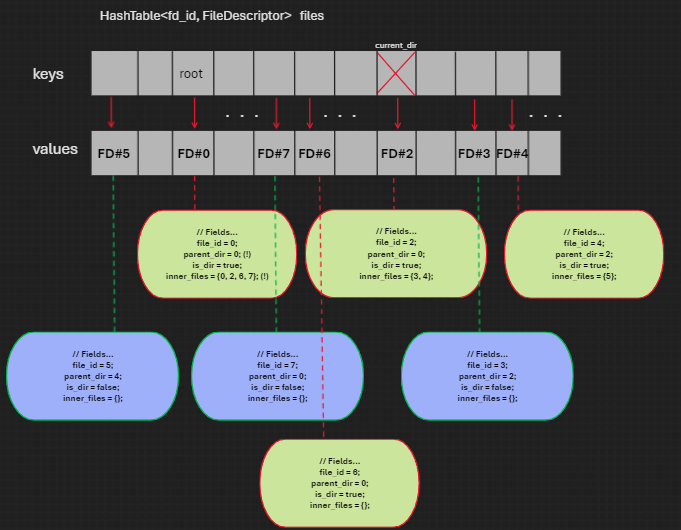
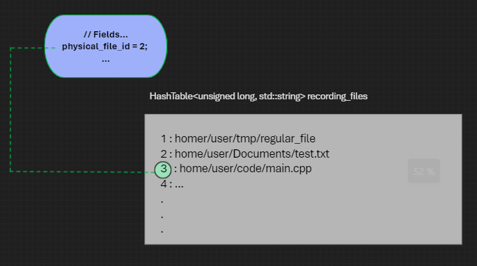
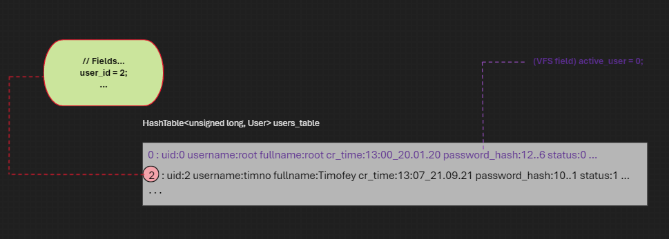

## VirtualFileSystem

Виртуальная файловая система представляет из себя программу, которая работает с виртуальными - существующими только в оперативной памяти - файлами. Виртуальный файл в рамках данной реализации может быть представлен как виртуальная директория или же как виртуальный регулярный файл (содержащий контент). Виртуальный файл хранит метаданные о себе внутри структуры __FileDescriptor__, а __VirtualFileSystem__ распоряжается объектами данной структуры, а также объектами классов __User__, __Group__.  Для удобного доступа к полям данных классов класс __VirtualFileSystem__ является для них дружественным. Сам внутренний контент виртуального файла хранится в физическом файле и пользователь сам линкует виртуальный файл и физический при создании первого.

### FileDescriptor

`FileDescriptor` - структура, которая содержит в себе метаданные о виртуальном файле. Каждый файловый дескриптор имеет:

- `fd_id` - уникальный _id_ в рамках _VFS_. Назначается классом __VirtualFileSystem__ при добавлении в _VFS_.
- `physical_file_id` - данный _id_ указывает на файл, в который записан контент виртуального файла. Данный _id_  является ключом для контейнера, хранящего пути к реальным файлам _VFS_, а сам контейнер хранится в  __VirtualFileSystem__ (поле `recording_files` VFS)
- `parent_dir_id` - _id_ родительской директории
- `filename` содержит только имя файла
- `content_offset` - информация о начале контента виртуального файла в физическом файле (смещение в байтах) 
- `content_size` - размер контента виртуального файла (в байтах) 
- `owner_user` - _id_ создателя
- `owner_group` - _id_ группы, которой доступен файл. Можно ограничить пользовательской группой, в которой состоит только _owner_user_
- `...-time` - время создания и изменений
- `file_permissions` типа __FilePermissions__. Устройство прав доступа:

    1. __enum Permission__

    _Enum_ определяет права доступа к файлу или каталогу:

    | Значение | Целочисленное значение | Описание | Строковое представление |
    | ----------------------- | ------------------------ | ------------------------- | ------------------------|
    | NONE | 0 | Отсутствие прав доступа | -- |
    | READ | 1 | Право на чтение | r- |
    | WRITE | 2 | Право на запись | -w |
    | READWRITE | 3 |Права на чтение и запись | rw |

    2.  __FilePermissions__

    Структура соединяет в себе права доступа к виртуальному файлу для *owner_user*, участников *owner_group* и всех остальных  пользователей.

- `inner_files` - хэш-множество с _id_ объектов __FileDescriptor__, которые лежат внутри директории, если текущий __FileDescriptor__ ею является. Если __FileDescriptor__ не директория, то множество пустое. (fd_id других файлов в рамках VFS)

### User

Каждый пользователь имеет:

- `user_id` - уникальный _id_ в рамках _VFS_. Назначается классом __VirtualFileSystem__ при добавлении в _VFS_.
- `username` - имя пользователя (ник)
- `fullname` - полное имя пользователя (например ФИО)
- `creation_time` - время создания пользователя
- `password_hash` - хэш пароля (хэширование через *tmn_hash::hash<unsigned long>*)
- `UserStatus status` - элемент _enum_'а (`enum class UserStatus : unsigned int { SUPER = 0, LOCAL = 1, SYSTEM = 2 };`)
- `HashSet<unsigned int> groups` - таблица с _id_-шниками групп, в которых состоит пользователь

В системе может быть не более 999 пользователей. Такое ограничение связано с политикой идентификации групп: для пользовательских групп (создающихся по умолчанию при создании пользователя) отведены id от 0 до 1000, тогда как для произвольных групп (создающихся через _AddGroup(Group)_) id устанавливается от 1000.  

### VFS (внутренняя логика)

#### Поля и контейнеры, которыми руководит VFS

- `active_user` - _id_ активного пользователя
- `current_directory` - _id_ текущей рабочей директории
- `parent_dir_id` - _id_ родительской директории
- `HashTable<std::string, unsigned long> usernames` - хэш-таблица для быстрого поиска пользователя по _username_. Используется при необходимости обращения к какому-то пользователю по имени (например авторизация). Не несёт накладных расходов.
- `HashTable<std::string, unsigned long> groupnames` - хэш-таблица для быстрого поиска группы по _groupname_. Используется при необходимости обращения к какой-то группе по имени. Не несёт накладных расходов.
- `HashTable<unsigned long, std::string> recording_files` - хэш-таблица, ключом которой является _id_ физического файла, служащего для записи, а значением - путь к нему на устройстве.
- `HashTable<unsigned long, FileDescriptor> files` - хэш-таблица, ключом которой является _id_ виртуального файла, а значением - объект __FileDescriptor__, описывающий метаданные виртуального файла.
- `HashTable<unsigned long, User> users_table` - *user_id* : *User*
- `HashTable<unsigned long, Group> groups_table` - *group_id* : *Group*

#### Инициализация 

- Случай 1. Первая инициализация.
    Если VFS распознает, что VFS по точке входа (конфигурации) не создавалась (статический метод __bool VFSInSystem()__), то происходит создание необходимых для работы VFS файлов в точке входа и базовая настройка
- Случай 2. VFS уже существует.
    Происходит подтягивание всех объектов __FileDescriptor__, __User__, __Group__ из тех конфигурационных файлов, в которые VFS записывает их состояния при завершении работы в основной объект __VirtualFileSystem__. Также подтягивается другая необходимая информация, связанная с состоянием VFS перед завершением её последней работы.

#### Сохранение состояния 

Каждый внутренний объект умеет преобразовывать себя в строку определённого формата и аналогично восстанавливать себя из строки определённого формата. За это отвечают методы этих классов: `toString()`, `fromString()`. Примеры строк полученных из методов __toString()__ для разных классов:

```
fd_id:5 is_dir:0 ph_path:0 parent_dir:0 filename:regular_file content_offset:0 content_size:0 owner_u:0 owner_g:0 cr_time:13:07 mod_time:13:07 d_mod_time:13:07 <331> []

uid:2 username:timno fullname:Timofey cr_time:13:07 password_hash:10089081994332581363 status:1 [2,]

gid:2 groupname:timno uid:2 cr_time:13:07 [0,2,]
```

Таким образом, VFS достаточно просто вызвать данный метод для записи в файл. "Подъём" объекта происходит аналогично: записанная в файл строка обрабатывается статическим методом __fromString()__, который по аргументу создаёт объект владеющего типа.

#### PWD()

__PWD()__ отдаёт полный путь до текущей рабочей директории:

- берётся _id_ текущего файла
- пока не дойдем до *parent_id* = 0 итерируемся вверх по *parent_id* (взяли *parent_id*, обратились в __HashTable<unsigned long, FileDescriptor> files__ по этому _id_ (обращение по ключу за _О(1)_) и взяли *parent_id* уже для родительской директории. и так пока не дойдем до корневой папки VFS)

> 

#### Устройство файловой системы (наглядно)

- В хэш-таблице (поле _VritualFileSystem_) _files_ хранятся файлы-дексрипторы. Как это выглядит с точки зрения логики программы:

    

    Как это выглядит для пользователя:
    ```bash
        root 
        - 0 (root зациклен на себе)
        - 2 
            - 3
            - 4
            - 5
        - 6
        - 7 
        (вместо идентификаторов подставить имена файлов (files[id].filename))
    ```

- Связь поля класса _VirtualFileSystem_ *recording_files* и поля *physical_file_id* у одного конкретного виртуального файла (_FileDescriptor_):
    
    

- Связь поля класса _VirtualFileSystem_ *users_table* и поля *owner_user* у одного конкретного виртуального файла (_FileDescriptor_), а также поля класса _VirtualFileSystem_ *active_user*:

    

    Абсолютно аналогичная связь у *group_table* и *owner_group*

---

Таким образом, _VFS_ представляет из себя связную структуру файловых дескрипторов, использующих своего рода "указатели" на дочерние и родительские элементы: *parent_dir_id*, *inner_files*. Данные поля в совокупности с контейнером, который хранит объекты _FileDescriptor_ в классе _VirtualFileSystem_, руководящим организацией файловых дескрипторов в _VFS_, представляют строго упорядоченную иерархическую структуру. Так, многие методы похожи на графовые (для деревьев). Можно было это заметить по описанию метода _PWD()_ выше.

В папке __gui__ приведена реализация консольного пользовательского интерфейса. Для того, чтобы посмотреть всевозможные команды и их назначение, введите _help_