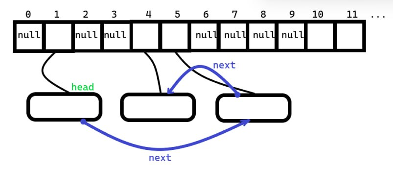
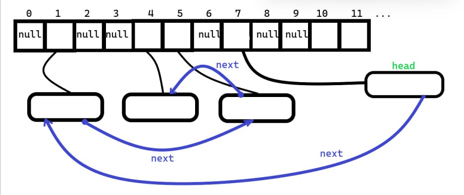
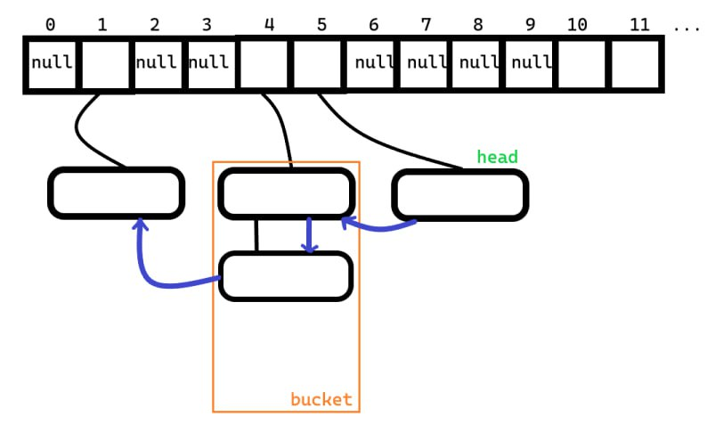
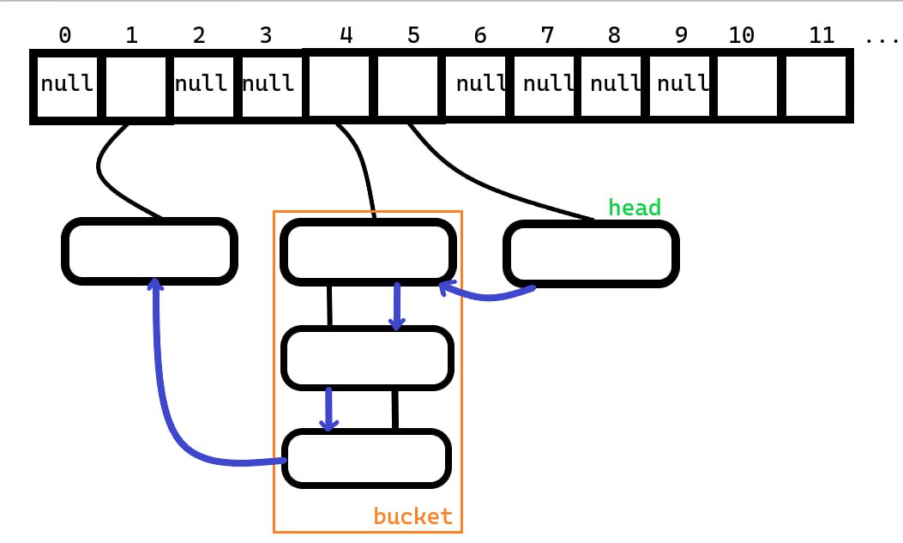
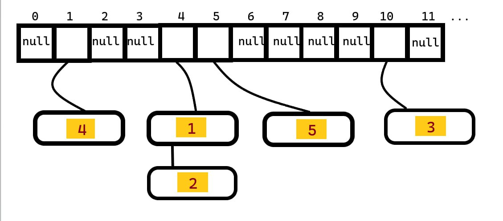

## Реализация HashTable
`HashTable`  реализует работу с коллизиями через стратегию обработки "цепочками"

`HashTable` состоит из массива указателей на узлы. Узел (внутренняя структура `Node`) хранит в себе:
- Пару ключ-значение: `tmn::Pair<const Key, Value> pair`
- Указатели: на следующий (`next`) и предыдущий (`prev`) узлы
- Посчитанный хэш (кэширован) - `cache`

Необходимость кэшировать хэш объясняется тем, что это сильно упрощает процесс поиска и перестройки хэш-таблицы.

___Поля хэш-таблицы___:
- `Node** _storage = nullptr` - тот самый массив указателей на узлы
- `std::size_t _size` = 0
- `std::size_t _buffer_size = 256`
- `float _max_load_factor = 0.5` ( `current_load_factor` рассчитывается по следующей формуле: `current_load_factor = (_size / _buffer_size)`)
- `std::allocator<Node> _alloc_node` - аллокатор  для создания узлов
- `Node* _head = nullptr` - голова двусвязного списка. для итератора (подробнее будет сказано ниже) хэш-таблица будет выглядеть ровно также, как двусвязный список

### Процесс вычисления хэш-индекса:
1) Прогнать аргумент через `Hash`
2) Взять остаток от полученного результата при делении на `_buffer_size`

### Аллокация объектов
Для аллокации будут использоваться:
```cpp
std::allocator<Node> _alloc_node;
// . . .
using allocator_traits_node = std::allocator_traits<std::allocator<Node>>;
```

Выбор аллокатора для хеш-таблиц не предусмотрен.

### Вставка элемента в контейнер
> Рассмотрим различные случаи вставки элемента в хэш-таблицу:
> 1) Вставка в пустую хэш-таблицу тривиальна: вставляется элемент по его хэш-индексу и `_head` выставляется в новый узел
> 2) Вставка в наполненную хэш-таблицу без образования корзины размера > 2(по хэш-индексу лежит `nullptr`):  предположим что вычисленный хэш-индекс равен 7. Тогда мы аллоцируем ноду и указываем, что `_storage[hash_index]`указывает на аллоцированный новый узел. При этом вставляем элемент в начало двусвязного списка - такое действие выполнится за время  _O(1)_, как и вся вставка. 
> 3) Вставка в наполненную хэш-таблицу, где по хэш-индексу уже есть ненулевой указатель.  Допустим мы вставляем в корзину, где уже целых два указателя (редкий случай). Важно понимать, что корзина это лишь абстрактное понятие и означает наличие хотя бы 1 элемента (в данной реализации указателя на элемент) в ячейке с конкретным хэш-индексом. В таком случае мы спускаемся в самый низ корзины и вставляем новый узел, зная предыдуший (до момента вставки самый нижний в корзине) и следующий (заберем у самого нижнего). Такая вставка займет _O(1)_ времени. "Спуск" по корзине осуществляется через next поле каждого узла, но вовремя остановиться и не перейти в другую корзину мы можем за счет кэшированного хэша - cache - в узлах (смотрим, чтобы `cache % _buffer_size` был равен `hash_index`).
>
> Во всех случаях `insert` возвращает `true`, если был вставлен новый элемент (то есть такого ключа раньше не встречалось в таблице) и `false`, если значение было лишь обновлено (то есть такой ключ уже встречался в таблице).
> Таким образом, обновление "головы" двусвязного списка происходит не каждую вставку. В среднем (либо при полном, либо при незначительном количестве коллизий) прямая итерация по хэш-таблице выдаст нам все элементы в обратном порядке вставки.

### Поиск элемента
> Поиск осуществляется очень просто: вычисляем хэш-индекс, заходим в вычисленный узел. Пока ключ узла не будет совпадать с ключом, по которому мы ищем, делаем "спуск" по корзине. Также как и при вставке в корзину, останавливаемся за счет `cache` в узлах.

### Удаление элемента
> Удаление в два шага:
> 1) Поиск узла
> 2) Удаление узла. Именно здесь необходимо было использовать двусвязный список, а не односвязный. За счёт поля узла `prev` мы можем удалить элемент из двусвязного списка прямо из середины за _O(1)_ времени (пепепрошить узлы)

### Очистка таблицы
Вся таблица удаляется посредством удаления каждого узла (`size` раз удаляем "голову")

### Итерация по контейнеру
>
>Упрощенная иллюстрация внутреннего устройства HashTable. Числами отмечен порядок итерации. Если узел содержится в корзине, то его следующим узлом ___всегда___ будет нижний узел. При этом никакой взаимосвязи между порядком в `_storage` и порядком прямой итерации нет. Для итерации реализован простой list-подобного итератора (_forward iterator_).

На данный момент используется детерменированная хеш-функция из _STL_ (просто функтор обернут в функцию для сомнительного удобоства). Хеширование каких-то базовых типов реализовано самостоятельно. См. `Hash()`